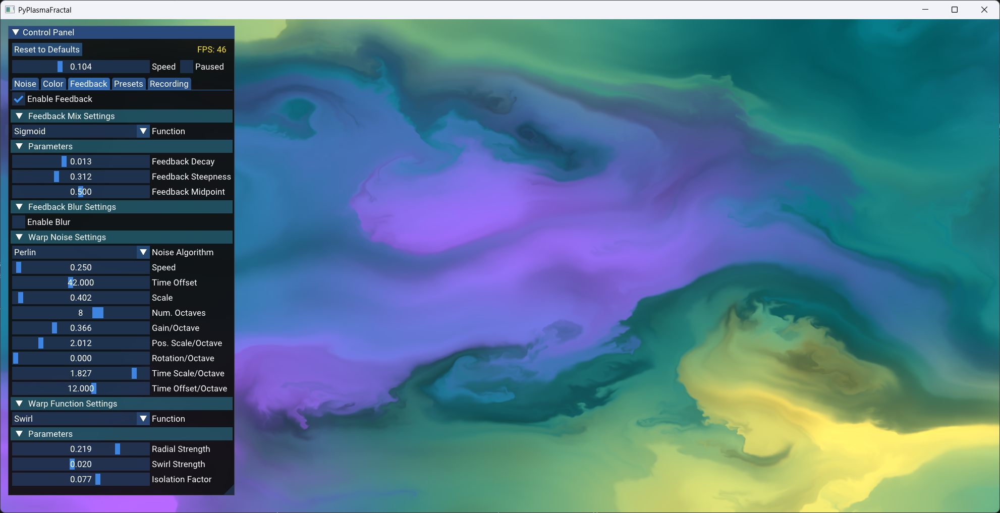

# PyPlasmaFractal

PyPlasmaFractal is a Python based real-time application for rendering and exploring fractal noise visuals, focusing on feedback effects to create dynamic flow. It allows for the generation of a wide range of effects such as clouds, smoke, or fluid-like visuals.

[](https://www.youtube.com/watch?v=P58PxfewxO4 "PyPlasmaFractal Video - Colorful Flow")
<br>
Demo Video #1

[](https://www.youtube.com/watch?v=-JK6erDcDWs "PyPlasmaFractal Video - Flow Painting")
<br>
Demo Video #2

## Features

- Real-time generation and manipulation of fractal noise.
- Advanced feedback effects using fractal noise-based warping to create complex visual patterns.
- Capability to generate diverse visuals including cloud-like, smoke-like, and fluid-like effects.
- Interactive controls for adjusting fractal parameters on-the-fly.
- Preset system to load and save fractal parameters.
- High-performance graphics rendering using OpenGL.
- Video recording.

## Installation

Before running the application, ensure you have the necessary libraries installed. You can install them using pip:

```bash
pip install moderngl glfw imgui PyOpenGL PyOpenGL_accelerate numpy appdirs imageio[ffmpeg]

```

## Usage

To start the application, run the following command:
```bash
python main.py
```

## Contributing

Contributions to PyPlasmaFractal are welcome. Please feel free to fork the repository, make changes, and submit pull requests.

## License

This project is licensed under the MIT License - see the [LICENSE](LICENSE) file for details.

## Authors

- zett42 - Initial work

## Acknowledgments

This project uses additional code from the following open source libraries. Each library comes with its own license terms, which you
can typically find by looking for links in the source code of this project.

### Wombat - An efficient texture-free GLSL procedural noise library

by Brian Sharpe
http://briansharpe.wordpress.com
https://github.com/BrianSharpe
